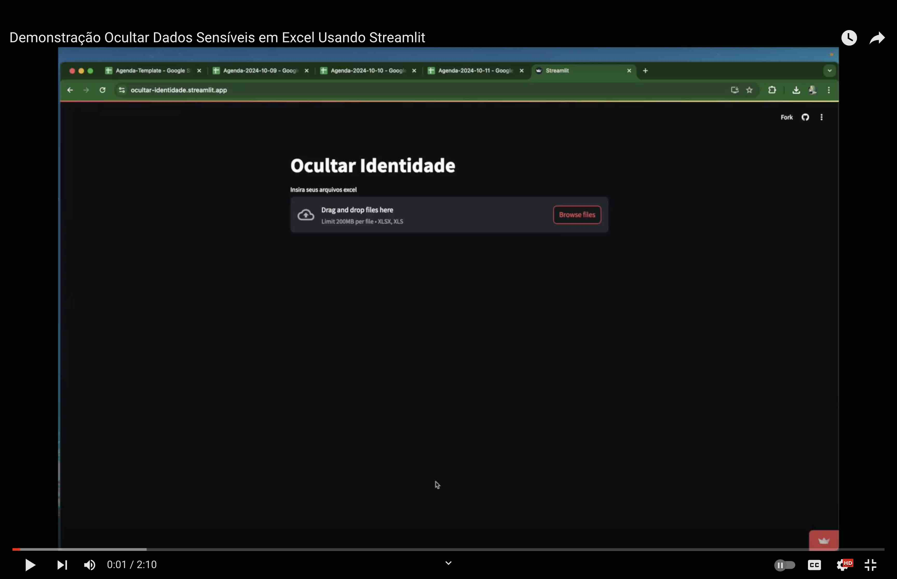

# Automatic Privacy Generator Streamlit App

## Goal
The goal of this app is to help a specific hospital share their data for ML training without sharing sensitive data such as children's names. 
The goal of the ML project is to optimize their schedules so the actual names are not needed only past history. 
Feel free to clone this repo and modify as needed.

## Demonstration (Portuguese only)
Even though the video is in Portuguese, you can still benefit from the walk through by just following along.

